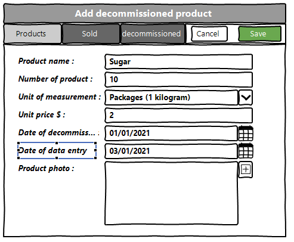
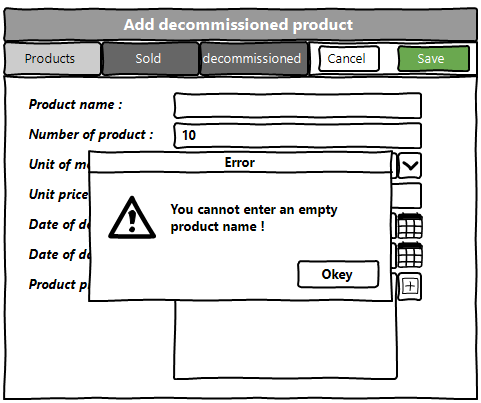
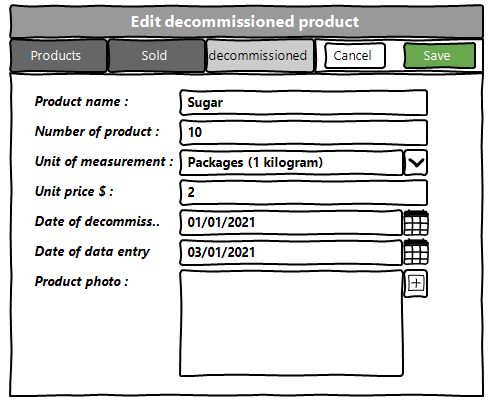
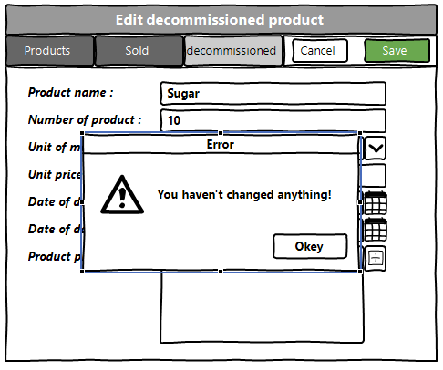
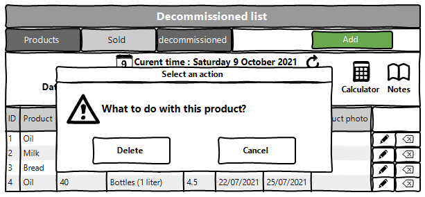

<h1 align="center">Web application for accounting of goods in warehouse</h1>

## Vision

"Web application for accounting of goods in 
warehouse"
is an application that allows you to record
information about goods that are stored 
in warehouses of enterprises.

Application should provide:

* Storing a list of products
in a database;
* Storing a list of warehouses
in a database;
* Storing a list of clients
in a database;
* Displaying a list of products ;
* Displaying a list of clients ;
* Displaying a list of warehouses ;
* Updating the list of products
(adding, deleting);
* Updating the list of clients
(adding, deleting);
* Updating the list of warehouses
(adding, deleting);
* Display of the list of shipment product ;
* Display of the list of delivery product ;
* Updating the list of shipment product
(adding, deleting);
* Updating the list of delivery product
(adding, deleting);
* Filtering by date of delivery;
* Filtering by date of shipment.

## 1. Storekeeper
### 1.1 Display list of Storekeeper
The mode is designed to view the list of Storekeeper.

<b>Main scenario</b>:
* User selects item “Storekeeper”;
* Application displays list of Storekeeper.

Pic. 1.1 View the storekeeper list.

The list displays the following columns:
* Products - name of the products;
* Nubmer of products - products not distributed to warehouses;
* Unit of measurement - in what value is our product measured;
* Unit price $ - price per product;
* Price $ - price for all products;
* Clients - organizations that have provided products for storage;
* Product photo - photos of our product.
### 1.2 Arrange the delivery of the goods

<b>Main scenario</b>:
* Administrator clicks the “Arrange the delivery of the 
goods” button in the storekeeper list view mode;
* Application displays form to enter delivery 
data(pic. 1.2);
* Administrator enters delivery data and presses 
“Arrange the delivery of the 
goods” button;
* If any data is entered incorrectly, incorrect 
data messages are displayed(pic. 1.2.1);
* If entered data is valid, then record is adding 
to database;
* If new delivery record is successfully added,
then list of storekeeper with added records is displaying.

<b>Cancel operation scenario</b>:
* Administrator clicks the “Arrange the delivery of the 
goods” button in the storekeeper list view mode;
* Application displays form to enter delivery 
data;
* Administrator enters delivery data and 
presses “Cancel” button;
* Data don’t save in database, then list of 
storekeeper records is displaying to administrator.

Pic. 1.2 Arrange the delivery of the goods.

<b>When arrange the delivery, the following 
details are entered:</b>
* Date of delivery - date and time of delivery;
* Products - name of the products;
* Nubmer of products - products not distributed to warehouses;
* Unit of measurement - in what value is our product measured;
* Unit price $ - price per product;
* Price $ - price for all products;
* Clients - organizations that have provided products for storage;
* Product photo - photos of our product.

<b>If the data is entered incorrectly, it will display the corresponding error.</b>

Pic. 1.2.1 Error when arrange delivery.

### 1.3 Arrange the shipment of products

<b>Main scenario</b>:
* Administrator clicks the “Arrange the shipment of products” 
button in the storekeeper list view mode;
* Application displays form to enter shipment 
data(pic. 1.3);
* Administrator enters shipment data and presses 
“Arrange the shipment of products” button;
* If any data is entered incorrectly, incorrect 
data messages are displayed(pic. 1.3.1);
* If entered data is valid, then record is adding 
to database;
* If new shipment record is successfully added,
then list of storekeeper with added records is displaying.

<b>Cancel operation scenario</b>:
* Administrator clicks the “Arrange the shipment of products”
button in the storekeeper list view mode;
* Application displays form to enter shipment 
data;
* Administrator enters delivery data and 
presses “Cancel” button;
* Data don’t save in database, then list of 
storekeeper records is displaying to administrator.

Pic. 1.3 Arrange the shipment of the goods.

<b>When arrange the shipment, the following 
details are entered:</b>
* Date of shipment - date and time of delivery;
* Reason - reason for shipment;
* Products - name of the products;
* Nubmer of products - products not distributed to warehouses;
* Unit of measurement - in what value is our product measured;
* Unit price $ - price per product;
* Price $ - price for all products;
* Clients - organizations that have provided products for storage;
* Product photo - photos of our product.

<b>If the data is entered incorrectly, it will display the corresponding error.</b>

Pic. 1.3.1 Error when arrange shipment.

### 1.4 Distribute products to warehouses

<b>Main scenario</b>:
* Administrator clicks the “Distribute products to warehouses” 
button in the storekeeper list view mode;
* Application displays form to enter distribute 
data(pic. 1.4);
* Administrator enters distribute data and presses 
“Distribute products to warehouses” button;
* If entered data is valid, then record is adding 
to database;
* If new distribute record is successfully added,
then list of storekeeper, warehouses, clients and goods
with added records is displaying.

<b>Cancel operation scenario</b>:
* Administrator clicks the “Distribute products to warehouses”
button in the storekeeper list view mode;
* Application displays form to enter distribute 
data;
* Administrator enters distribute data and 
presses “Cancel” button;
* Data don’t save in database, then list of 
storekeeper, warehouses, clients and goods records is 
displaying to administrator.

Pic. 1.4 Distribute products to warehouses.

<b>When distribute products, the following 
details is selected:</b>
* Products - name of the products;
* Nubmer of products - products not distributed to warehouses;
* Unit of measurement - in what value is our product measured;
* Unit price $ - price per product;
* Price $ - price for all products;
* Clients - organizations that have provided products for storage;
* Product photo - photos of our product;
* Warehouses - which warehouse should the products be distributed to.

### 1.5 Get products from the warehouse

<b>Main scenario</b>:
* Administrator clicks the “Get products from the warehouse” 
button in the storekeeper list view mode;
* Application displays form to enter withdrawal 
data(pic. 1.5);
* Administrator enters withdrawal data and presses 
“Get products from the warehouse” button;
* If entered data is valid, then record is adding 
to database;
* If new withdrawal record is successfully added,
then list of storekeeper, warehouses, clients and goods
with added records is displaying.

<b>Cancel operation scenario</b>:
* Administrator clicks the “Get products from the warehouse”
button in the storekeeper list view mode;
* Application displays form to enter withdrawal 
data;
* Administrator enters withdrawal data and 
presses “Cancel” button;
* Data don’t save in database, then list of 
storekeeper, warehouses, clients and goods records is 
displaying to administrator.

Pic. 1.5 Distribute products to warehouses.

<b>When distribute products, the following 
details is selected:</b>
* Products - name of the products;
* Nubmer of products - products not distributed to warehouses;
* Unit of measurement - in what value is our product measured;
* Unit price $ - price per product;
* Price $ - price for all products;
* Clients - organizations that have provided products for storage;
* Product photo - photos of our product;
* Warehouses - from which warehouse to withdrawal products.

## 2. Sold
### 2.1 Display list of Sold

This mode is intended for viewing and editing the sold list

<b>Main scenario:</b>
* User selects item “Sold”;
* Application displays list of sold.

Pic. 2.1 View the sold list.

<b>The list displays the following columns:</b>
* ID – unique sold number;
* Product - name of the products;
* Number of products - number of products sold;
* Unit of measurement - in what value is our product measured;
* Unit price $ - price per product sold;
* Date of sold - shows the day on which the product was sold;
* Date of data entry - shows on what day the information 
was entered into the database;
* Product photo - photos of our product.

<b>Filtering by date:</b>
* In the sold list view mode, the administrator sets a 
filter by date and clicks the update list button 
(to the right of the date input field);
* The app will only show products during a certain 
sales period;
* If an incorrect date range is specified, it displays 
an error message(pic. 2.1.1).
* In the current tab, you can also find out the 
current date and time there ;
* Also in this tab there is a calculator and a 
notepad for faster counting and writing, respectively

<b>Restrictions:</b>
* Start date of the period should be less than end date of the period;
* If start date is blank, then filtering by end date only.
* If end date is blank, then filtering by start date only.
* Updating data after selecting the filtering conditions is carried out by pressing the “Refresh” button.

Pic. 2.1.1 Incorrect date.

### 2.2 Add sold product

<b>Main scenario:</b>
* Administrator clicks the “Add” button in the Sold list view mode;
* Application displays form to enter Sold data(pic. 2.2);
* Administrator enters Sold data and presses “Save” button;
* If any data is entered incorrectly, incorrect data messages are displayed(pic. 2.2.1);
* If entered data is valid, then record is adding to database;
* If new Sold record is successfully added, then list of Sold with added records is displaying.

<b>Cancel operation scenario:</b>
* Administrator clicks the “Add” button in the sold list view mode;
* Application displays form to enter sold data;
* User enters employees data and presses “Cancel” button;
* Data don’t save in database, then list of sold records is displaying to administrator.
* If the administrator selects the menu item "Department", "Employee", "Positions" or "Specialization", the data will not be saved to the database and the corresponding form with updated data will be opened.

 Pic. 2.2 Add sold.

<b>When adding a sold, the following details are entered:</b>
* Product - name of the products;
* Number of products - number of products sold;
* Unit of measurement - in what value is our product measured;
* Unit price $ - price per product sold;
* Date of sold - shows the day on which the product was sold;
* Date of data entry - shows on what day the information 
was entered into the database;
* Product photo - photos of our product.

<b>If the data is entered incorrectly, it will 
display the corresponding error.</b>

Pic. 2.2.1 Error when adding.

### 2.3 Edit sold product

<b>Main scenario:</b>
* Administrator clicks the “Edit” button in the sold list view mode;
* Application displays form to enter sold data(pic. 2.3);
* Administrator enters sold data and presses “Save” button;
* If any data is entered incorrectly, incorrect data 
messages are displayed(pic. 2.3.1);
* If entered data is valid, then edited data is added to database;
* If sold record is successfully edited, then list of sold 
with added records is displaying.

Cancel operation scenario:
* Administrator clicks the “Edit” button in the sold list view mode;
* Application displays form to enter sold data;
* Administrator enters sold data and presses “Cancel” button;
* Data don’t save in database, then list of sold records is 
displaying to Administrator.
* If the administrator selects the menu item "Products", 
"Sold" or "Decommissioned", the data will not be saved to the database and the 
corresponding form with updated data will be opened.

Pic. 2.3 Edit sold_product.

<b>If the data is entered incorrectly, it will display the corresponding error.</b>

Pic. 2.3.1 Error when editing.

### 2.4 Removing the sold product

<b>Main scenario:</b>
* The administrator, while in the list of sold mode, presses the "Delete" button in the selected client line;
* Application displays confirmation dialog “Please confirm delete sold product?”;
* The administrator confirms the removal of the sold product;
* Record is deleted from database;
* If sold product record is successfully deleted, then list of sold without deleted records is displaying.

Pic. 2.4 Delete sold product dialog.

<b>Cancel operation scenario:</b>
* Administrator is in display mode of sold list and press “Delete” button;
* Application displays confirmation dialog “Please confirm delete product?”;
* Administrator press “Cancel” button;
* List of sold product without changes is displaying.

## 3. Decommissioned
### 3.1 Display list of Decommissioned

This mode is intended for viewing and editing the decommissioned list
<b>Main scenario:</b>
* User selects item “Decommissioned”;
* Application displays list of decommissioned.

Pic. 3.1 View the decommissioned list.

<b>The list displays the following columns:</b>
* ID – unique decommissioned number;
* Product - name of the products;
* Number of products - number of products decommissioned;
* Unit of measurement - in what value is our product measured;
* Unit price $ - price per product decommissioned;
* Date of decommissioned - shows the day on which the product was decommissioned;
* Date of data entry - shows on what day the information 
was entered into the database;
* Product photo - photos of our product.

<b>Filtering by date:</b>
* In the decommissioned list view mode, the administrator sets a 
filter by date and clicks the update list button 
(to the right of the date input field);
* The app will only show products during a certain 
sales period;
* If an incorrect date range is specified, it displays 
an error message(pic. 3.1.1).
* In the current tab, you can also find out the 
current date and time there ;
* Also in this tab there is a calculator and a 
notepad for faster counting and writing, respectively

<b>Restrictions:</b>
* Start date of the period should be less than end date of the period;
* If start date is blank, then filtering by end date only.
* If end date is blank, then filtering by start date only.
* Updating data after selecting the filtering conditions is carried out by pressing the “Refresh” button.

Pic. 3.1.1 Incorrect date.

### 3.2 Add decommissioned product

<b>Main scenario:</b>
* Administrator clicks the “Add” button in the decommissioned list view mode;
* Application displays form to enter decommissioned data(pic. 3.2);
* Administrator enters Sold data and presses “Save” button;
* If any data is entered incorrectly, incorrect data messages are displayed(pic. 3.2.1);
* If entered data is valid, then record is adding to database;
* If new decommissioned record is successfully added, then list of Sold with added records is displaying.

<b>Cancel operation scenario:</b>
* Administrator clicks the “Add” button in the decommissioned list view mode;
* Application displays form to enter decommissioned data;
* User enters employees data and presses “Cancel” button;
* Data don’t save in database, then list of decommissioned records is displaying to administrator.
* If the administrator selects the menu item "Department", "Employee", "Positions" or "Specialization", 
the data will not be saved to the database and the corresponding form with updated data will be opened.

Pic. 3.2 Add decommissioned product.

<b>When adding a decommissioned, the following details are entered:</b>
* Product - name of the products;
* Number of products - number of products decommissioned;
* Unit of measurement - in what value is our product measured;
* Unit price $ - price per product decommissioned;
* Date of decommissioned - shows the day on which the product was decommissioned;
* Date of data entry - shows on what day the information 
was entered into the database;
* Product photo - photos of our product.

<b>If the data is entered incorrectly, it will 
display the corresponding error.</b>

Pic. 3.2.1 Error when adding.

### 3.3 Edit decommissioned product

<b>Main scenario:</b>
* Administrator clicks the “Edit” button in the decommissioned list view mode;
* Application displays form to enter decommissioned data(pic. 3.3);
* Administrator enters decommissioned data and presses “Save” button;
* If any data is entered incorrectly, incorrect data 
messages are displayed(pic. 3.3.1);
* If entered data is valid, then edited data is added to database;
* If sold record is successfully edited, then list of decommissioned 
with added records is displaying.

Cancel operation scenario:
* Administrator clicks the “Edit” button in the decommissioned list view mode;
* Application displays form to enter decommissioned data;
* Administrator enters sold data and presses “Cancel” button;
* Data don’t save in database, then list of decommissioned records is 
displaying to Administrator.
* If the administrator selects the menu item "Products", 
"Sold" or "Decommissioned", the data will not be saved to the database and the 
corresponding form with updated data will be opened.

Pic. 3.3 Edit decommissioned product.

<b>If the data is entered incorrectly, it will display the corresponding error.</b>

Pic. 3.3.1 Error when editing.

### 3.4 Removing the decommissioned product

<b>Main scenario:</b>
* The administrator, while in the list of decommissioned mode, presses the "Delete" button in the selected client line;
* Application displays confirmation dialog “Please confirm delete decommissioned product?”;
* The administrator confirms the removal of the decommissioned product;
* Record is deleted from database;
* If sold product record is successfully deleted, then list of sold without deleted records is displaying.

Pic. 3.4 Delete decommissioned product dialog.

<b>Cancel operation scenario:</b>
* Administrator is in display mode of decommissioned list and press “Delete” button;
* Application displays confirmation dialog “Please confirm delete product?”;
* Administrator press “Cancel” button;
* List of decommissioned product without changes is displaying.

