<h1 align="center">Web application for accounting of goods in the warehouse of the enterprise</h1>

## Vision

"Web application for accounting of goods in 
the warehouse of the enterprise"
is an application that allows you to record
information about goods that are stored 
in warehouses of enterprises.

Application should provide:

* Storing a list of products
in a database;
* Displaying a list of products ;
* Updating the list of products
(adding, editing, deleting);
* Display of the list of products sold ;
* Updating the list of products sold
(adding, editing, deleting);
* Filtering by date of sale;
* Display of the list of decommissioned goods ;
* Updating the list of decommissioned goods
(adding, editing, deleting);
* Filtering by the date of debiting;

## 1. Products
### 1.1 Display list of products
The mode is designed to view the list of products.

<b>Main scenario</b>:
* User selects item “Products”;
* Application displays list of Products.

Pic. 1.1 View the products list.

The list displays the following columns:
* ID – department number;
* Products - name of the products;
* Nubmer of products - number of products in stock;
* Unit of measurement - in what value is our product measured
* Unit price $ - price per product
* Product photo - photos of our product
### 1.2 Add product

<b>Main scenario</b>:
* Administrator clicks the “Add” button in the 
products list view mode;
* Application displays form to enter department 
data(pic. 1.2);
* Administrator enters products data and presses 
“Save” button;
* If any data is entered incorrectly, incorrect 
data messages are displayed(pic. 1.2.1);
* If entered data is valid, then record is adding 
to database;
* If new product record is successfully added,
then list of products with added records is displaying.

<b>Cancel operation scenario</b>:
* Administrator clicks the “Add” button in the 
products list view mode;
* Application displays form to enter product data;
* Administrator enters product data and 
presses “Cancel” button;
* Data don’t save in database, then list of 
products records is displaying to administrator.
* If the administrator selects the menu item 
"Products", "Sold" or "Decommissioned", the data will not be saved to the 
database and the corresponding form with updated data
will be opened.

Pic. 1.2 Add product.

<b>When adding a product, the following 
details are entered:</b>
* Products name - name of the products;
* Nubmer of products - number of products in stock;
* Unit of measurement - in what value is our product measured;
* Unit price $ - price per product;
* Product photo - photos of our product;

<b>If the data is entered incorrectly, it will display the corresponding error.</b>

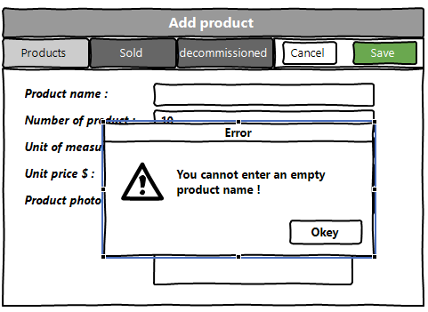

Pic. 1.2.1 Error when adding.

### 1.3 Edit product

<b>Main scenario:</b>
* Administrator clicks the “Edit” button in 
the product list view mode;
* Application displays form to enter 
product data (pic. 1.3);
* Administrator edit product 
data and presses “Save” button;
* If any data is entered incorrectly, 
incorrect data messages are displayed (pic. 1.3.1);
* If entered data is valid, then edited data 
is added to database;
* If department record is successfully edited, then 
list of products with added records is displaying. 

<b>Cancel operation scenario:</b>
* Administrator clicks the “Edit” button in the 
product list view mode;
* Application displays form to enter product data;
* Administrator enters product data and presses 
“Cancel” button;
* Data don’t save in database, then list of 
product records is displaying to administrator.
* If the administrator selects the menu 
item "Products", "Sold" or "Decommissioned", the data 
will not be saved to the database and the corresponding 
form with updated data will be opened.

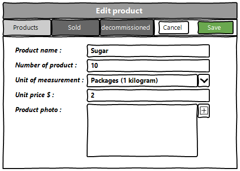

Pic. 1.3 Edit product.

<b>When editing a product, the following details 
are entered:</b>
* Products name - name of the products;
* Nubmer of products - number of products in stock;
* Unit of measurement - in what value is our product measured;
* Unit price $ - price per product;
* Product photo - photos of our product;

<b>If the data is entered incorrectly, it will 
display the corresponding error.</b>

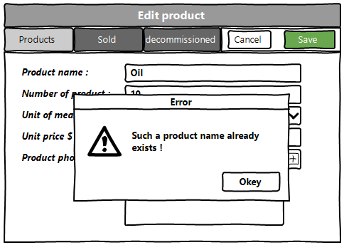

Pic. 1.3.1 Error when editing.

### 1.4 Removing the product

<b>Main scenario:</b>
* Administrator, while in the list of products 
presses the "Delete" button in the selected product line;
* If the product can be removed, a confirmation 
dialog is displayed;
* In the selected dialog box, you must select
an operation: "Delete", "Put in 'Sold'", "Put in 
'Decommissioned'" (pic. 1.4);
* If the administrator selects the 'Delete' operation, the 
record is deleted from the database;
* If the administrator selects the 'Put in "Sold" operation',
the record is transferred to the database of the 'Sold' section;
* If the administrator selects the 'Put in "Decommissioned"'
operation, the record is transferred to the database of 
the 'Decommissioned' section;
* If a product record has been successfully deleted, a 
list of products without deleted records is displayed.
* If the product record has been successfully moved to the
"Decommissioned" or "Sold" section, a data field will 
be added to the desired column;

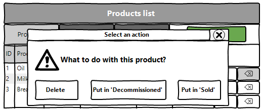

Pic. 1.4 Delete product dialog.

<b>Operation cancellation scenario:</b>
* The administrator is in the display mode of the list 
of products and presses the "Delete" button;
* The application displays a dialog box for selecting the 
action "What to do with this product?";
* The administrator presses the ”Cancel" button;
* The list of products without changes is displayed. 

## 2. Sold
### 2.1 Display list of Sold

This mode is intended for viewing and editing the sold list

<b>Main scenario:</b>
* User selects item “Sold”;
* Application displays list of sold.

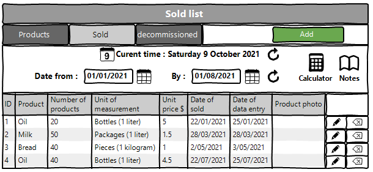

Pic. 2.1 View the sold list.

<b>The list displays the following columns:</b>
* ID – unique sold number;
* Product - name of the products;
* Number of products - number of products sold;
* Unit of measurement - in what value is our product measured;
* Unit price $ - price per product sold;
* Date of sold - shows the day on which the product was sold;
* Date of data entry - shows on what day the information 
was entered into the database;
* Product photo - photos of our product.

<b>Filtering by date:</b>
* In the sold list view mode, the administrator sets a 
filter by date and clicks the update list button 
(to the right of the date input field);
* The app will only show products during a certain 
sales period;
* If an incorrect date range is specified, it displays 
an error message(pic. 2.1.1).
* In the current tab, you can also find out the 
current date and time there ;
* Also in this tab there is a calculator and a 
notepad for faster counting and writing, respectively

<b>Restrictions:</b>
* Start date of the period should be less than end date of the period;
* If start date is blank, then filtering by end date only.
* If end date is blank, then filtering by start date only.
* Updating data after selecting the filtering conditions is carried out by pressing the “Refresh” button.

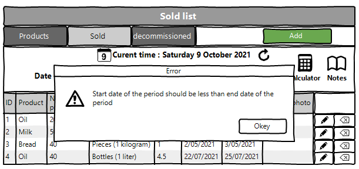

Pic. 2.1.1 Incorrect date.

### 2.2 Add sold product

<b>Main scenario:</b>
* Administrator clicks the “Add” button in the Sold list view mode;
* Application displays form to enter Sold data(pic. 2.2);
* Administrator enters Sold data and presses “Save” button;
* If any data is entered incorrectly, incorrect data messages are displayed(pic. 2.2.1);
* If entered data is valid, then record is adding to database;
* If new Sold record is successfully added, then list of Sold with added records is displaying.

<b>Cancel operation scenario:</b>
* Administrator clicks the “Add” button in the sold list view mode;
* Application displays form to enter sold data;
* User enters employees data and presses “Cancel” button;
* Data don’t save in database, then list of sold records is displaying to administrator.
* If the administrator selects the menu item "Department", "Employee", "Positions" or "Specialization", the data will not be saved to the database and the corresponding form with updated data will be opened.

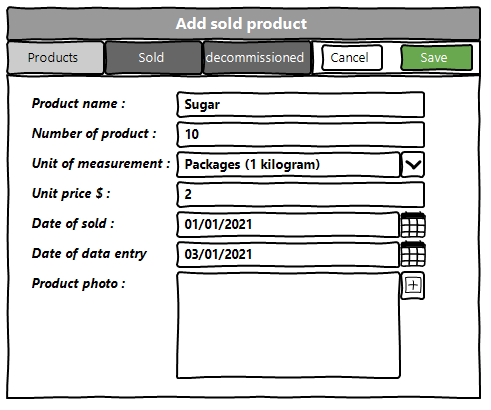
 Pic. 2.2 Add sold.

<b>When adding a sold, the following details are entered:</b>
* Product - name of the products;
* Number of products - number of products sold;
* Unit of measurement - in what value is our product measured;
* Unit price $ - price per product sold;
* Date of sold - shows the day on which the product was sold;
* Date of data entry - shows on what day the information 
was entered into the database;
* Product photo - photos of our product.

<b>If the data is entered incorrectly, it will 
display the corresponding error.</b>

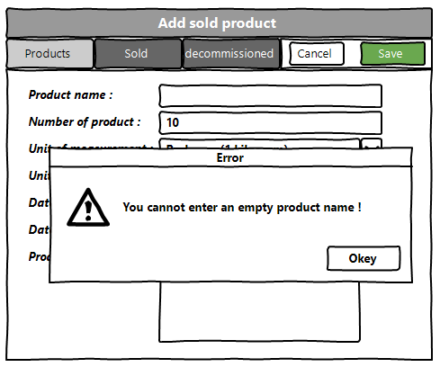

Pic. 2.2.1 Error when adding.

### 2.3 Edit sold product

<b>Main scenario:</b>
* Administrator clicks the “Edit” button in the sold list view mode;
* Application displays form to enter sold data(pic. 2.3);
* Administrator enters sold data and presses “Save” button;
* If any data is entered incorrectly, incorrect data 
messages are displayed(pic. 2.3.1);
* If entered data is valid, then edited data is added to database;
* If sold record is successfully edited, then list of sold 
with added records is displaying.

Cancel operation scenario:
* Administrator clicks the “Edit” button in the sold list view mode;
* Application displays form to enter sold data;
* Administrator enters sold data and presses “Cancel” button;
* Data don’t save in database, then list of sold records is 
displaying to Administrator.
* If the administrator selects the menu item "Products", 
"Sold" or "Decommissioned", the data will not be saved to the database and the 
corresponding form with updated data will be opened.

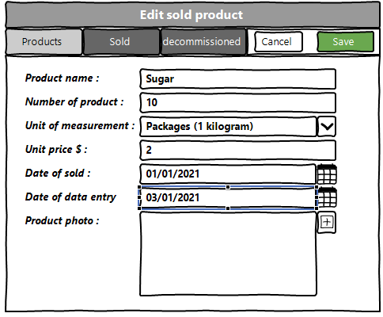

Pic. 2.3 Edit sold_product.

<b>If the data is entered incorrectly, it will display the corresponding error.</b>

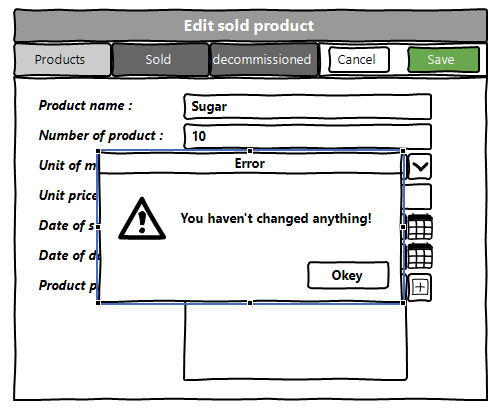

Pic. 2.3.1 Error when editing.

### 2.4 Removing the sold product

<b>Main scenario:</b>
* The administrator, while in the list of sold mode, presses the "Delete" button in the selected client line;
* Application displays confirmation dialog “Please confirm delete sold product?”;
* The administrator confirms the removal of the sold product;
* Record is deleted from database;
* If sold product record is successfully deleted, then list of sold without deleted records is displaying.

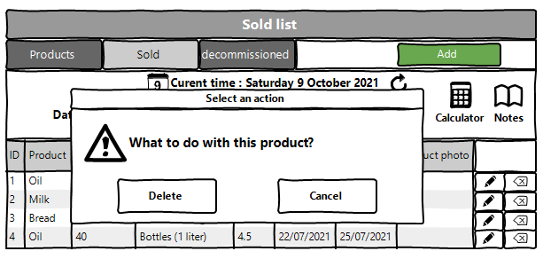

Pic. 2.4 Delete sold product dialog.

<b>Cancel operation scenario:</b>
* Administrator is in display mode of sold list and press “Delete” button;
* Application displays confirmation dialog “Please confirm delete product?”;
* Administrator press “Cancel” button;
* List of sold product without changes is displaying.

## 3. Decommissioned
### 3.1 Display list of decommissioned

This mode is intended for viewing and editing the decommissioned list

<b>Main scenario:</b>
* User selects item “Decommissioned”;
* Application displays list of decommissioned.

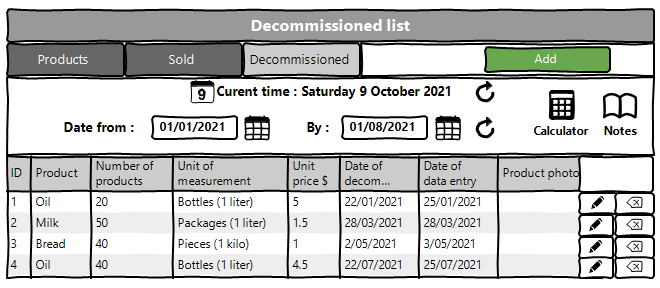

Pic. 3.1 View the decommissioned list.

<b>The list displays the following columns:</b>
* ID – unique decommissioned number;
* Product - name of the products;
* Number of products - number of products decommissioned;
* Unit of measurement - in what value is our product measured;
* Unit price $ - price per product decommissioned;
* Date of decommissioned - shows the day on which the product was decommissioned;
* Date of data entry - shows on what day the information 
was entered into the database;
* Product photo - photos of our product.

<b>Filtering by date:</b>
* In the sold list view mode, the administrator sets a 
filter by date and clicks the update list button 
(to the right of the date input field);
* The app will only show products during a certain 
sales period;
* If an incorrect date range is specified, it displays 
an error message(pic. 3.1.1).
* In the current tab, you can also find out the 
current date and time there ;
* Also in this tab there is a calculator and a 
notepad for faster counting and writing, respectively

<b>Restrictions:</b>
* Start date of the period should be less than end 
date of the period;
* If start date is blank, then filtering by end date only.
* If end date is blank, then filtering by start date only.
* Updating data after selecting the filtering 
conditions is carried out by pressing the “Refresh” button.

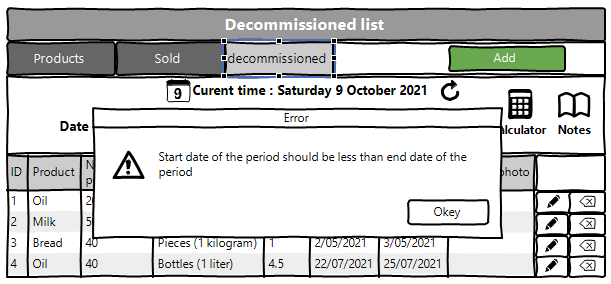

Pic. 3.1.1 Incorrect date.

### 2.2 Add sold product

<b>Main scenario:</b>
* Administrator clicks the “Add” button in the Sold list view mode;
* Application displays form to enter Sold data(pic. 2.2);
* Administrator enters Sold data and presses “Save” button;
* If any data is entered incorrectly, incorrect data messages are displayed(pic. 2.2.1);
* If entered data is valid, then record is adding to database;
* If new Sold record is successfully added, then list of Sold with added records is displaying.

<b>Cancel operation scenario:</b>
* Administrator clicks the “Add” button in the sold list view mode;
* Application displays form to enter sold data;
* User enters employees data and presses “Cancel” button;
* Data don’t save in database, then list of sold records is displaying to administrator.
* If the administrator selects the menu item "Department", "Employee", "Positions" or "Specialization", the data will not be saved to the database and the corresponding form with updated data will be opened.

 Pic. 2.2 Add sold.

<b>When adding a sold, the following details are entered:</b>
* Product - name of the products;
* Number of products - number of products sold;
* Unit of measurement - in what value is our product measured;
* Unit price $ - price per product sold;
* Date of sold - shows the day on which the product was sold;
* Date of data entry - shows on what day the information 
was entered into the database;
* Product photo - photos of our product.

<b>If the data is entered incorrectly, it will 
display the corresponding error.</b>

Pic. 2.2.1 Error when adding.

### 2.3 Edit sold product

<b>Main scenario:</b>
* Administrator clicks the “Edit” button in the sold list view mode;
* Application displays form to enter sold data(pic. 2.3);
* Administrator enters sold data and presses “Save” button;
* If any data is entered incorrectly, incorrect data 
messages are displayed(pic. 2.3.1);
* If entered data is valid, then edited data is added to database;
* If sold record is successfully edited, then list of sold 
with added records is displaying.

Cancel operation scenario:
* Administrator clicks the “Edit” button in the sold list view mode;
* Application displays form to enter sold data;
* Administrator enters sold data and presses “Cancel” button;
* Data don’t save in database, then list of sold records is 
displaying to Administrator.
* If the administrator selects the menu item "Products", 
"Sold" or "Decommissioned", the data will not be saved to the database and the 
corresponding form with updated data will be opened.

Pic. 2.3 Edit sold_product.

<b>If the data is entered incorrectly, it will display the corresponding error.</b>

Pic. 2.3.1 Error when editing.

### 2.4 Removing the sold product

<b>Main scenario:</b>
* The administrator, while in the list of sold mode, presses the "Delete" button in the selected client line;
* Application displays confirmation dialog “Please confirm delete sold product?”;
* The administrator confirms the removal of the sold product;
* Record is deleted from database;
* If sold product record is successfully deleted, then list of sold without deleted records is displaying.

Pic. 2.4 Delete sold product dialog.

<b>Cancel operation scenario:</b>
* Administrator is in display mode of sold list and press “Delete” button;
* Application displays confirmation dialog “Please confirm delete product?”;
* Administrator press “Cancel” button;
* List of sold product without changes is displaying.

