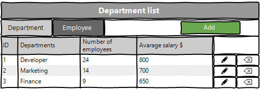

<h1 align="center">Web application for managing departments and employees</h1>

## Vision

"Web Application for Managing Departments and Employees"
is an application that allows you to record 
information about employees and departments.

Application should provide:

* Storing list of department and list of employee 
in a database;
* Display list of department and the average 
salary for these departments;
* Updating the list of department 
(adding, editing, removing);
* Display list of employee in the departments 
with an indication of the salary for each employee;
* Updating the list of employee 
(adding, editing, removing);
* Filtering by employees born on a certain date 
or in the period between dates;

## 1. Department
### 1.1 Display list of department
The mode is designed to view the list of department.

<b>Main scenario:</b>
* User selects item “Department”;
* Application displays list of Department.

 Pic. 1.1 View the Department list.

The list displays the following columns:
* ID – department number;
* Department - name of the department;
* Nubmer of employees - number of employees in this department
* The average salary $ - average salary of all employees of the department
