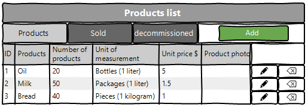
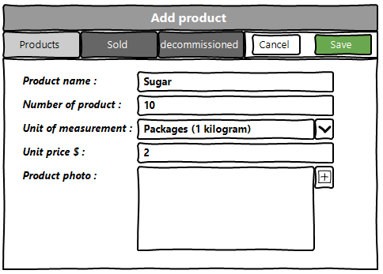

<h1 align="center">Web application for accounting of goods in the warehouse of the enterprise</h1>

## Vision

"Web application for accounting of goods in 
the warehouse of the enterprise"
is an application that allows you to record
information about goods that are stored 
in warehouses of enterprises.

Application should provide:

* Storing a list of products
in a database;
* Displaying a list of products ;
* Updating the list of products
(adding, editing, deleting);
* Display of the list of products sold ;
* Updating the list of products sold
(adding, editing, deleting);
* Filtering by date of sale;
* Display of the list of decommissioned goods ;
* Updating the list of decommissioned goods
(adding, editing, deleting);
* Filtering by the date of debiting;

## 1. Products
### 1.1 Display list of products
The mode is designed to view the list of products.

Main scenario:
* User selects item “Products”;
* Application displays list of Products.

 Pic. 1.1 View the products list.

The list displays the following columns:
* ID – department number;
* Products - name of the products;
* Nubmer of products - number of products in stock;
* Unit price $ - price per product
### 1.2 Add product

Main scenario:
* Administrator clicks the “Add” button in the 
products list view mode;
* Application displays form to enter department 
data(pic. 1.2);
* Administrator enters products data and presses 
“Save” button;
* If any data is entered incorrectly, incorrect 
data messages are displayed(pic. 1.3);
* If entered data is valid, then record is adding 
to database;
* If error occurs, then error message is
displaying(pic. 1.4);
* If new product record is successfully added,
then list of products with added records is displaying.

Cancel operation scenario:
* Administrator clicks the “Add” button in the 
products list view mode;
* Application displays form to enter product data;
* Administrator enters product data and 
presses “Cancel” button;
* Data don’t save in database, then list of 
products records is displaying to administrator.
* If the administrator selects the menu item 
"Products", "Sold" or "Decommissioned", the data will not be saved to the 
database and the corresponding form with updated data
will be opened.

 Pic. 1.2 Add product.

<b>When adding a department, the following details are entered:</b>
* Name department - name department
* Add employee - adding department employees(optional field)

<b>If the data is entered incorrectly, it will display the corresponding error.</b>

 Pic. 2.3 Error when adding.

 Pic. 2.4 Error when adding.
